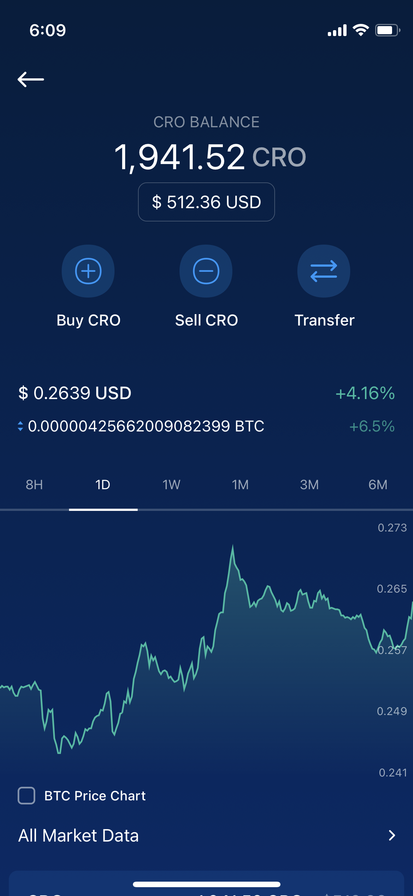

# From Hazlor.finance App

## Transfer assets using Hazlor.finance App

The Hazlor.finance App will be able to seamlessly transfer selected assets over to Hazlor on Day 1. The withdrawal process will be exactly the same as how you would transfer funds to a separate chain.

**Supported assets on Day 1**: CRO, USDT, USDC, DAI, ETH, WBTC

Only selected tokens mentioned above will be available for withdrawal into Hazlor on Day 1 of Hazlor Mainnet.

### Step-by-step Walkthrough

**Step 1**:
Select the token that you want to withdraw from your Crypto Wallet
Only selected tokens mentioned above will be available for withdrawal into Hazlor on Day 1 of Hazlor Mainnet.

**Step 2**: Click on “Transfer” and “Withdraw”

**Step 3**: Select “External wallet” and whitelist your Hazlor wallet address 

**Step 4**: Select Hazlor Network and paste in your Hazlor wallet address

You should have a Hazlor wallet address ready at this point (Either on Metamask, Hazlor.finance DeFi Wallet or any other wallet supporting the Hazlor chain). No memo is required to withdraw your funds to Hazlor. Once you have confirmed that your Hazlor wallet address is accurate, click “Continue”

**Step 5**: Select your newly whitelisted Hazlor wallet address and input the amount of assets that you wish to withdraw
After entering the amount that you wish to withdraw, click the “Withdraw” button. Once you click Withdraw, you will be prompted to enter your Password and 2FA (If enabled).

**Step 6**: Confirm your Transfer and click confirm
