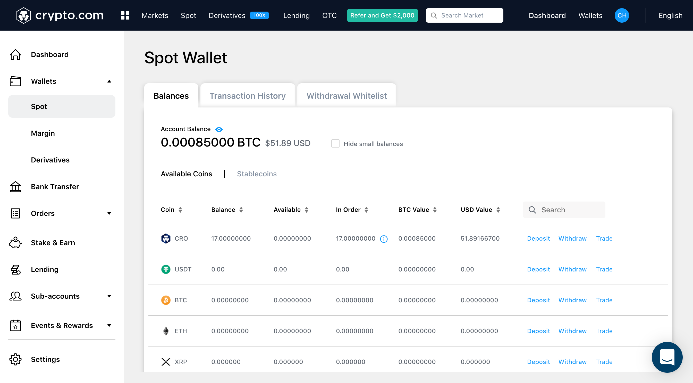
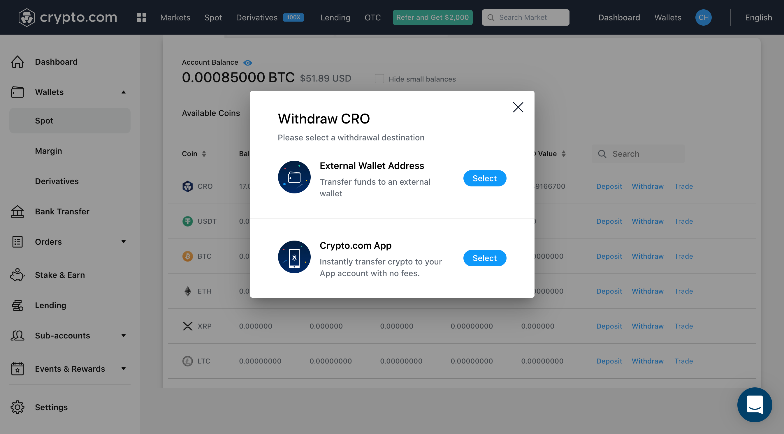
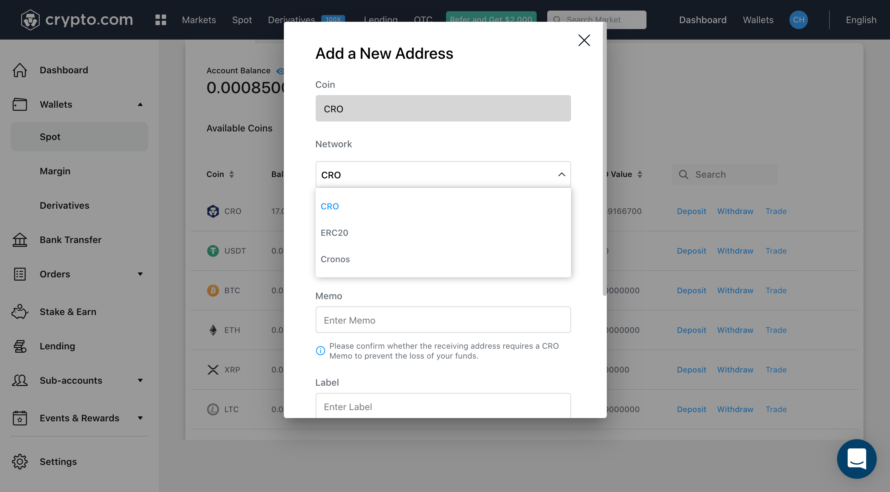
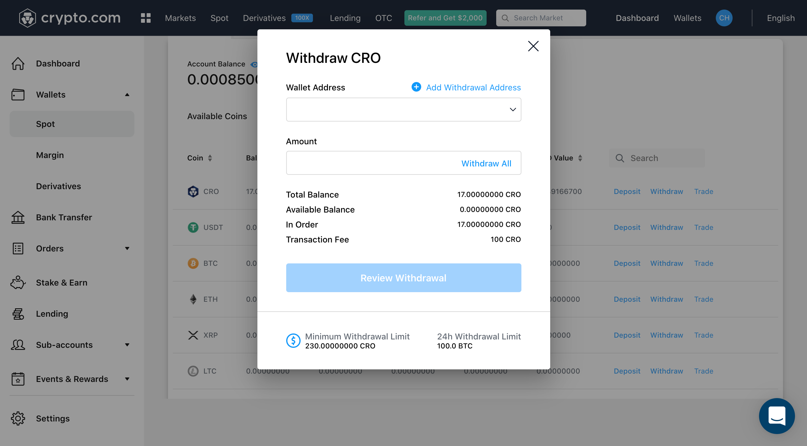

# From Hazlor.finance Exchange

## Transfer assets using Hazlor.finance Exchange

The Hazlor.finance Exchange will be supporting the seamless transfer of selected assets over to Hazlor on Day 1. The withdrawal process will be exactly the same as how you would transfer funds to a separate chain.

Supported assets on Day 1: CRO, USDT, USDC, DAI, ETH, WBTC

### Step-by-step Walkthrough

**Step 1**: Select the asset that you want to bridge over in your spot wallet and click withdraw

**Step 2**: Select “External Wallet Address”

**Step 3**: Select “Add Withdrawal Address”

**Step 4**: Select the Hazlor Network, add your Hazlor wallet address and save it

**Step 5**: Select your Hazlor wallet address that you have whitelisted and input the withdrawal amount

**Step 6**: Review your withdrawal information and enter your 2FA code to Confirm Withdrawal
Once you click “Review Withdrawal”, you will be taken to a new page for you to confirm your withdrawal information and type in your 2FA code to finalise your withdrawal. Your assets will appear on your Hazlor wallet within a few minutes of withdrawal confirmation.
